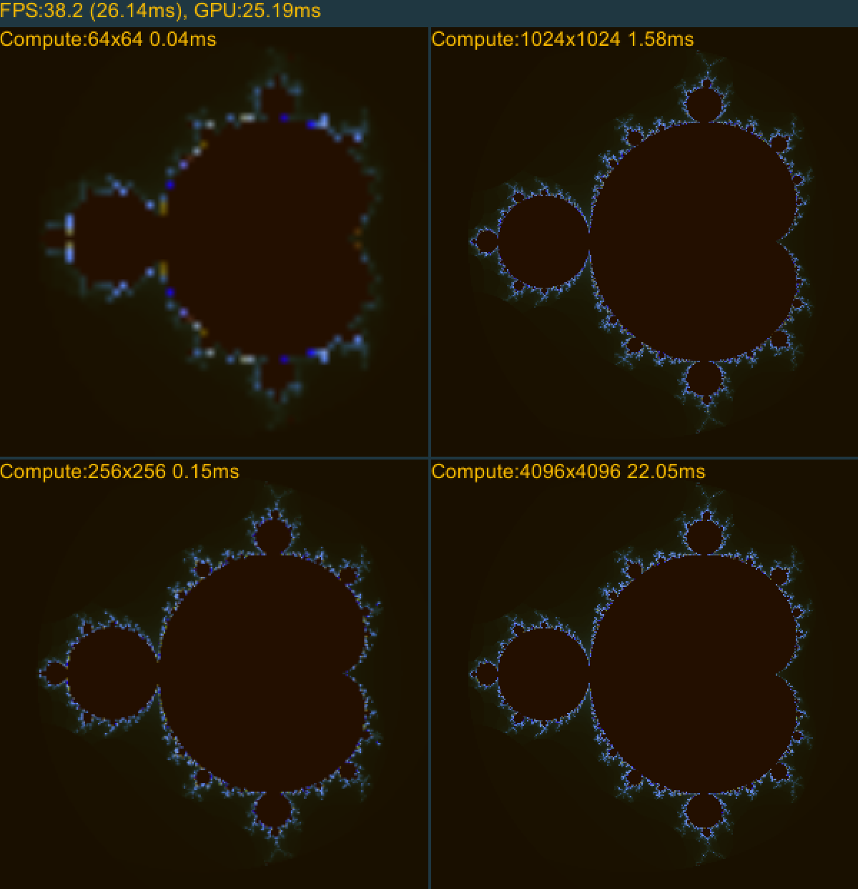

# Unity D3D11Plugins

This is a collection of D3D11 functionalities not currently found in Unity. 
Currently only GPU timing is supported. Please check the example for more information.
The GPUTimings.h can be used in any C++ project, only D3D11Device needs to be provided.

## Example

Open UnityProject and then ExampleScene scene.

## How to build

Open the solution file in D3D11Plugins folder and build. Only x64 version was tested.
